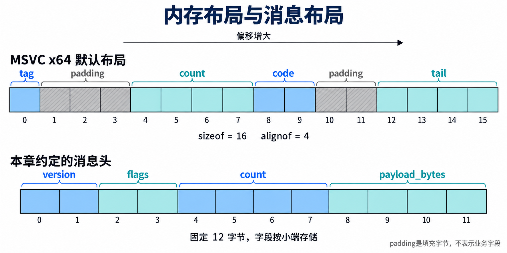

# 第 1 章 重新看 C/C++ 中的数据与内存

假设一个反作弊组件收到用户态程序提交的事件列表。消息头写着有 `0x20000000` 条记录，每条占 8 字节，实际收到的却只有 12 字节消息头。如果代码先用 32 位无符号整数计算条目区大小，乘法结果会回绕成 0。接着，即使分配内存成功，分到的空间也装不下这些记录。后续按原条目数复制，便可能越过缓冲区边界。这是本章设定的教学场景，用来分析长度检查，不对应真实产品或实测事故。

在内核反作弊场景中，接收配置、暂存事件、遍历受保护对象，都要处理这些问题。长度算错会影响系统稳定性，结构体布局理解错了会读到错误字段，过期指针则可能让一次普通访问变成内存破坏。学完本章，你应能对一份简单消息说明每次读取需要多少字节，并判断数据何时可以访问、何时必须拒绝。

本章按 **2026 年 9 月 22 日** 查阅的微软 C++、x64 布局与驱动缓冲区安全文档编写。平台约定来自官方资料，消息格式、容量限制和题目输入由本教程设定。代码采用 C++17，以第 0 章的 MSVC x64 工具环境解释；C 与 C++ 规则有差异时会单独指出。

阅读需要基本的函数、数组和结构体知识。动手前完成[第 0 章的用户态小实验](chapter-00-environment.md#usermode)，能编译程序、设置断点并查看变量即可。本章练习在开发机以普通用户权限完成，无须启动目标虚拟机或建立内核调试连接，也不编译或加载驱动。文中的数字输出均为按代码推导的预期值，读者需保存自己的运行记录。

<a id="integers"></a>

## 1.1 整数与位运算

### 先确定数值有多宽

位（bit）只能表示 0 或 1。本章平台的一个字节（byte）含 8 位，无符号 8 位整数因此有 256 种取值，从 0 到 255。二进制每一位对应 2 的一个幂，十六进制每一位对应 4 个二进制位，适合按字节读数据。

例如，二进制 `00010010` 等于十六进制 `0x12`，也等于十进制 18。`0x` 是 C/C++ 十六进制字面量的前缀。`0x1234` 需要 16 位表示，写成两字节时还需要说明这两个字节的排列次序，稍后讲消息布局时会用到。

本章用 `<cstdint>` 中的固定宽度整数写消息字段，用 `<cstddef>` 中的 `std::size_t` 表示本地对象大小和字节计数。头文件提供声明，`std::` 表示这些名称属于 C++ 标准库的命名空间。

| 类型 | MSVC x64 下的字节数 | 本章用途或限制 |
| --- | --- | --- |
| `std::uint8_t` | 1 | 无符号 8 位整数，范围为 0 至 255 |
| `std::uint16_t` | 2 | 无符号 16 位整数，适合版本与较小标志字段 |
| `std::uint32_t` | 4 | 无符号 32 位整数，最大值为 `0xFFFFFFFF` |
| `std::int32_t` | 4 | 有符号 32 位整数，范围为 −2147483648 至 2147483647 |
| `std::uint64_t` | 8 | 无符号 64 位整数，用来承接本章较宽的计算 |
| `int`、`long` | 4 | Windows x64 下的 `long` 仍占 4 字节 |
| `void*`、`std::size_t` | 8 | 分别用于指针和本地大小，宽度会随目标平台变化 |

固定宽度类型在所选 MSVC 平台可用。不能把这张表推成所有 C/C++ 平台的约定，也不能因操作系统是 64 位，就认为源码中的每次乘法都会用 64 位完成。[微软整数范围][ranges]、[x64 类型与布局][x64]、[`sizeof` 与大小类型][sizeof]

### 相同位模式可以表示不同的值

无符号数把所有位用于表示非负值。本章 MSVC 的有符号整数采用补码（two's complement）表示。以 8 位为例，`00000001` 表示 1，逐位取反得到 `11111110`，再加 1 得到 `11111111`，这是 −1 的补码表示。同样的 `11111111` 按无符号 8 位解释则是 255。

补码解释的是表示方式。有符号算术溢出仍属于未定义行为（undefined behavior），也就是语言不保证这段程序接下来会怎样。不能把一次观察到的回绕当作可依赖的规则。无符号算术则按类型位宽取模，例如本章的 32 位无符号加法会保留结果的低 32 位。[C++ 整数表示与算术规则][integers-standard]

转换类型同样需要检查范围。下面是**局部 C++ 示例**，假定已经包含 `<cstdint>`，只展示表达式，不涉及内存分配。

```cpp
std::uint32_t wide = 0x1234u;
auto low = static_cast<std::uint8_t>(wide);   // 0x34
std::uint32_t restored = low;                // 0x00000034

std::int32_t negative = -1;
std::int64_t signed_wide = negative;          // 仍为 -1
auto unsigned_value = static_cast<std::uint32_t>(negative); // 0xFFFFFFFF
```

`u` 后缀使这里的整数字面量采用无符号类型。`static_cast<T>` 明确要求转换到类型 `T`；它不会替程序拒绝超出范围的输入。`auto` 让编译器从右侧推导变量类型，所以 `low` 的类型是 `std::uint8_t`。

第一组发生截断（truncation），高位已经丢失，再扩展也无法找回。无符号数扩展到更宽类型时高位补 0；负的有符号数扩展到更宽有符号类型时保持数值，在补码表示下表现为符号扩展。把 −1 转成无符号数则会得到该无符号类型的最大值，不能再当作“长度为负”的错误标记。[标准整数转换][conversions]

混合比较也会发生转换。本章中，`std::int32_t` 的 −1 与 `std::uint32_t` 的 8 比较时，−1 会转为无符号数，所以 `negative < std::uint32_t{8}` 为假。如果外部接口允许用有符号数传长度，应先拒绝负数，再确认正值能放入目标类型，最后转换。

### 用掩码表达独立开关

位掩码（bit mask）用一个或几个置 1 的位选择状态。这里假设教学事件有两个独立开关，位 0 表示记录创建事件，位 1 表示记录退出事件。它们只属于本章示例，没有对应的 Windows 标志常量。

下面是**局部 C++ 示例**，前提仍是包含 `<cstdint>`，省略了输入与输出。

```cpp
constexpr std::uint32_t kCreated = 1u << 0;
constexpr std::uint32_t kExited = 1u << 1;
std::uint32_t flags = kCreated | kExited;

bool has_created = (flags & kCreated) != 0;
bool has_both = (flags & (kCreated | kExited)) == (kCreated | kExited);
flags &= ~kExited;
flags ^= kCreated;
```

`constexpr` 声明可在编译时确定的常量。`|` 把需要的位合起来，`&` 留下两侧都为 1 的位，`~` 逐位取反，`^` 在两侧位不同的位置得到 1。`flags &= ~kExited` 清除退出位，随后 `flags ^= kCreated` 翻转创建位。此例最后的 `flags` 为 0。检查“至少有一位”与“全部位都存在”需要不同条件，不能都写成与运算结果不为 0。

`<<` 左移会把位向高位移动，`>>` 右移会向低位移动。对无符号数右移时高位补 0。移位前必须知道左操作数经过整数提升后的位宽，并保证移位次数非负且小于这个位宽。本章中 `1u << 31` 合法，`1u << 32` 是未定义行为。小于 `int` 的整数类型参与许多运算前会先提升为 `int`，因此把结果存入 64 位变量也不能修复已经发生的错误移位。[整数提升][conversions]、[移位规则][shifts]

处理未知标志位时应有明确约定。本章消息只接受已定义的位，出现其他位就拒绝。后续增加协议版本时再决定如何兼容，不能让一个尚未解释的位悄悄改变行为。

<a id="pointers"></a>

## 1.2 指针与边界

### 一个地址没有告诉你整块内存的情况

指针（pointer）保存用于指向对象或函数的值。`T*` 告诉编译器如何通过这个指针访问 `T` 类型对象，但不会自动携带数组长度，也不保证该地址当前允许读写。后文所有原始指针示例，都要求调用者先提供真实存在且生存期足够的对象。

缓冲区（buffer）是一段有边界的内存。描述它时至少需要起始位置、可访问字节数和有效期。还应分清容量与有效长度。例如一块可容纳 64 字节的存储只收到 12 字节消息，解析输入时应使用 12，不能用容量 64 让未收到的数据参与判断。

下面是**局部 C++ 示例**，前提是已包含 `<cstdint>`。

```cpp
std::uint32_t values[3] = {10, 20, 30};
std::uint32_t* p = values;
std::uint32_t* end = values + 3;
```

`p + 1` 指向第二个元素，地址相对增加 `sizeof(std::uint32_t)`，本章为 4 字节。`values + 3` 是尾后指针（one-past-the-end pointer），可用于同一数组范围内的结束比较，不能通过 `*end` 读取。`values + 4` 已经超出允许的指针运算范围，不能先算出它再决定是否解引用。

指针相减、加减整数也受所属数组范围约束。两个无关对象的地址即使数值相近，也不能借此把它们当成一个数组遍历。[原始指针与数组][pointers]、[C++17 指针运算规则][pointer-arithmetic]

### 数组传入函数后，长度需要另外传递

数组在许多表达式中会转换为指向首元素的指针，常称数组退化（array-to-pointer decay）。例如函数形参写成 `const unsigned char data[]` 时，会被调整为指针形参。函数内部对它用 `sizeof` 得到的是指针大小。[数组传参][arrays]

下面是**局部用户态 C++ 示例**，展示最小的取字节操作。假定包含 `<cstddef>`；调用者保证 `data` 指向至少 `length` 个可读字节，读取期间这段内存不会失效或被并发修改，`value` 是可写对象且不与输入重叠。这里不处理任意用户地址的合法性，不可直接照搬成驱动入口。

```cpp
bool ReadByte(const unsigned char* data, std::size_t length,
              std::size_t index, unsigned char& value)
{
    if (data == nullptr || index >= length) {
        return false;
    }
    value = data[index];
    return true;
}
```

`nullptr` 是空指针常量，不指向对象。`||` 按从左到右的顺序判断，左侧为真就不再求右侧；这里先拒绝空指针或越界下标，然后才访问数组。返回 `false` 时不会修改 `value`，调用方需要检查返回结果。

这段检查无法识别一个已经释放、但数值仍非空的地址。如果调用者谎报长度，也不能凭一个较大的 `length` 使对象真的变大。内核中的用户地址、跨进程访问与并发变化有更多约束，分别留到第 8、21 和 25 章。

### 变量还在，不代表对象还活着

作用域（scope）说明某个名字在源码哪里可见；对象生存期（object lifetime）说明对象何时存在。两者需要分别追踪。

下面是**故意含错的局部 C++ 阅读材料**。不要编译运行来猜结果，第二行注释处没有可依赖的读值。

```cpp
const int* borrowed = nullptr;
{
    int local = 42;
    borrowed = &local;
}
// 此处 local 的生存期已经结束。
// int result = *borrowed;  // 错误，禁止取消注释后运行
```

`borrowed` 这个名字在外层仍然可见，保存的地址也可能没有改变，但它已经成为悬空指针（dangling pointer）。相反，动态分配的对象可以活过某个局部指针变量的作用域，必须另有明确的释放责任，否则会泄漏。动态资源的具体管理方式留到第 2 章。[对象生存期][lifetime]、[动态对象的生存期][new-lifetime]

所有权（ownership）描述谁负责让资源保持有效并最终释放。借用指针只允许在约定期限内访问对象，复制一个地址不会延长对象生存期。把一个指针设为 `nullptr` 也只改变这个变量，其他指针副本不会自动失效。

如果做过异步业务，可以把“函数返回后，排队的任务仍会执行”作为联系。本章对应的问题是排队的数据是否还存在。C++ 原始指针没有自动保活能力，后面的内核回调还有执行条件限制。本章只分析对象何时失效，不据此假定回调可以等待或随意分配内存。

<a id="layout"></a>

## 1.3 结构体布局

### 成员之间可能隔着填充字节

结构体成员的偏移（offset）是它距离结构体起点的字节数。对齐（alignment）要求某类对象从特定倍数的地址开始。编译器可能插入填充（padding）来满足这些要求，所以成员大小相加未必等于结构体大小。

下面是**局部 C++ 类型示例**，前提是包含 `<cstdint>`，使用 MSVC x64 默认布局，未用 `#pragma pack` 或额外对齐声明改变规则。

```cpp
struct LocalRecord {
    std::uint8_t tag;
    std::uint32_t count;
    std::uint16_t code;
    std::uint32_t tail;
};
```

按本章条件，布局推导如下。

| 内容 | 偏移 | 字节数 | 原因 |
| --- | --- | --- | --- |
| `tag` | 0 | 1 | 首个成员从起点开始 |
| 填充 | 1 至 3 | 3 | 下一个成员从 4 的倍数处开始 |
| `count` | 4 | 4 | 占据偏移 4 至 7 |
| `code` | 8 | 2 | 起点满足 2 字节对齐 |
| 填充 | 10 至 11 | 2 | 为后面的 4 字节成员留出边界 |
| `tail` | 12 | 4 | 占据偏移 12 至 15 |

`sizeof(LocalRecord)` 因此为 16，`alignof(LocalRecord)` 为 4。`sizeof` 求对象表示所占字节数，包括填充；`alignof` 求类型的对齐要求。`offsetof(LocalRecord, count)` 求成员偏移。这里都是简单的标准布局类型，可以使用 `offsetof`；不要把它用于位域或未经确认适用条件的复杂 C++ 类。[`sizeof`][sizeof]、[`alignof`][alignof]、[`offsetof`][offsetof]

结构体总大小还要满足整个类型的对齐要求，以便数组的下一个元素继续正确对齐。如果删掉 `tail`，最后一个业务成员结束于偏移 9，结构体仍需占 12 字节，偏移 10 和 11 成为尾部填充。这些数字按微软的 x64 成员对齐与聚合布局规则推导。[x64 布局规则][x64]



图中的横向位置表示递增的字节偏移。上半部分由当前编译条件决定，下半部分由通信双方约定。每个格子占一个字节，下面的消息表给出对应字段的完整含义。

### 消息格式要单独约定

假设用户态程序把一批教学事件交给接收方。本章定义以下消息布局（message layout），专门用于练习，未实现任何 Windows 通信接口。

| 相对消息起点的字节偏移 | 字段名 | 编码与约定 |
| --- | --- | --- |
| 0 | `version` | 2 字节无符号整数，本章只接受 1 |
| 2 | `flags` | 2 字节位掩码，只有位 0 已定义，表示请求记录；允许 0 或 1 |
| 4 | `count` | 4 字节无符号整数，表示条目数，允许 0 至 1024 |
| 8 | `payload_bytes` | 4 字节无符号整数，只计条目区字节数，必须等于 `count × 8` |
| 12 | 条目区 | 每条 8 字节，前 4 字节为 `event_id`，后 4 字节为 `value` |

`event_id` 是教学事件编号，`value` 是随事件保存的无符号数值。本章只检查条目区大小，不把任何编号或数值解释成作弊事实。消息总长度必须正好等于 12 加条目区大小，不允许尾随字节。零条目消息合法，但必须恰好只有 12 字节，且 `payload_bytes` 为 0。1024 是教学资源上限，避免一个消息让接收方处理无限多记录。

所有多字节字段按小端序（little-endian）编码，即最低有效字节放在最低偏移处。例如 32 位数值 `0x12345678` 的四个字节按偏移递增依次为 `78`、`56`、`34`、`12`。大端序（big-endian）的顺序相反。这里是消息自身的约定，接收方应照此解码，不能让宿主字节序替自己决定协议。

固定宽度只解决字段占多少位。把一段字节缓冲区直接强转成 `LocalRecord*` 仍可能碰到长度不足、未对齐、字段顺序不同或 C++ 对象生存期与类型访问规则不满足的问题。强转不会创建对象、修复布局或验证数据。磁盘文件同样需要按文件格式解码。[对象生存期与存储][lifetime-standard]

本章直接从字节组装整数。例如下面的**局部 C++ 解码示例**要求 `p` 指向至少 4 个可读字节，读取期间保持有效且不变；包含 `<cstdint>`，省略了调用方长度检查。

```cpp
std::uint32_t ReadU32Le(const unsigned char* p)
{
    return static_cast<std::uint32_t>(p[0])
        | (static_cast<std::uint32_t>(p[1]) << 8)
        | (static_cast<std::uint32_t>(p[2]) << 16)
        | (static_cast<std::uint32_t>(p[3]) << 24);
}
```

先扩展到 32 位无符号类型再移位，可以明确运算宽度。函数名字中的 `Le` 表示小端，它是教程自定义函数，没有替代调用方检查边界。

`#pragma pack` 可以改变成员的打包对齐，使用时要成对保存并恢复设置。它不会验证消息长度，也不会约定字节序或解决对象生存期问题。本章不靠更改打包设置来读取消息。不能为压缩自己的结构体而改变 Windows 头文件类型所需的对齐。[微软打包设置说明][pack]

### 联合体与位域分别解决什么

联合体（union）的成员共享存储，大小需要容纳最大成员并满足对齐。例如用一个类型表示“编号或计数”，两种内容可以共用空间，但程序需要另有标记说明当前哪一个成员有效。一般不能在 C++ 中写入一个成员后，任意读取另一个成员来解释位模式；语言规定的少数例外不能扩展成通用做法。[C++ 联合体][unions]

位域（bit-field）允许声明成员占用若干位，适合受控编译条件下的紧凑表示。它的分配和布局依赖实现，不能仅凭声明顺序就认定某个位在通信格式中的位置。本章跨边界的标志使用固定宽度整数和明确掩码，也不把结构体填充字节当作字段发送。否则接收方可能看到无关存储内容，格式也会随布局变化。[微软位域规则][bitfields]

<a id="lengths"></a>

## 1.4 安全计算长度

### 先发生运算，才把结果存进去

回到开头的错误。下面是**故意含错的局部 C++ 算术示例**，供阅读与计算；只展示数值，没有分配或复制操作。

```cpp
std::uint32_t count = 0x20000000u;
std::uint32_t payload = count * 8u;
std::size_t total = 12u + payload;
```

数学上的乘积是 `0x100000000`，即 4294967296。本章的 `count * 8u` 在 32 位无符号类型中计算，结果对 2³² 取模，成为 0，于是 `total` 成为 12。外层用了 `std::size_t`，也无法找回之前丢掉的高位。

假如接收方按 `total` 分配了 12 字节，再按原来的 `count` 写入条目，分配器即便报告成功，也只履行了“分配 12 字节”的请求。检查分配结果仍然必要，但它不能修复分配之前的计算错误。这个推演与微软文档提醒的可变长缓冲区乘法溢出问题相同。[可变长缓冲区检查][variable-buffer]

把 `count` 先转成 `std::uint64_t` 再乘，可以容纳本例的结果。可它仍然远大于实际收到的 12 字节，也超过本章 1024 条的限制。运算能表示、缓冲区装得下、资源消耗可接受，是需要分别证明的条件。

### 用剩余空间约束计算

设 `length` 是实际可读字节数，消息头大小 `H` 为 12，每条大小 `E` 为 8。先要求 `length >= H`，才能读取完整消息头，也才能安全计算 `length - H`。

接着检查 `count <= (length - H) / E`。除法的结果是剩余空间最多容纳的完整条目数；只有这一步通过，才计算 `count * E`。此时乘积不超过剩余字节数，因此能放入同样的大小类型。`E` 在本章固定为 8，不会除以零。若接口允许传入条目大小，还必须先拒绝 0 或不符合协议的大小。

例如收到 28 字节，扣除消息头后剩 16 字节，最多容纳 2 条。`count` 为 2 时可以继续，为 3 时必须拒绝。收到 11 字节则应在读取消息头字段之前返回，不能先计算无符号的 `11 - 12`。[微软的减法与除法检查方法][variable-buffer]

如果正在计算尚未分配的存储大小，没有现成的 `length` 可比较，就使用目标大小类型的最大值 `M`。先确认 `H <= M`、`E > 0`，再要求 `count <= (M - H) / E`。一般加法 `a + b` 可先检查 `b <= M - a`，乘法 `a * b` 在 `b != 0` 时可先检查 `a <= M / b`。检查通过后计算，并另外限制资源消耗。

Windows 驱动开发也提供 `ntintsafe.h` 中的安全整数运算与转换函数，它们会报告溢出，调用方仍需处理失败。这里先理解检查为什么成立，具体返回状态和驱动调用方式留待后续章节。[安全整数函数][safe-integers]

### 一份可以逐行核对的用户态实验

下面是**完整的独立用户态 C++ 小实验**，用于核对布局和消息长度。本章自定义的 `ReadU16Le`、`ReadU32Le` 与 `ValidateMessage` 都不是 Windows API。程序只读取自己创建的数组，无动态分配、外部请求或待释放的系统资源。

`ValidateMessage` 的前提是 `data` 指向至少 `length` 个真实可读字节，调用期间保持有效且不变；空指针会被明确拒绝。返回 `true` 只表示版本、头部标志与长度关系符合本章约定，不代表条目内容可信。接到真实驱动上还需要权限、缓冲方式和并发等检查，本例没有实现这些内容。

`ReadU16Le` 与 `ReadU32Le` 分别读取 2 和 4 字节。它们由调用者保证边界，`ValidateMessage` 在调用它们之前先确认完整消息头已经存在。校验过程不保存输入指针，返回后也不会继续使用输入。

```cpp
#include <cassert>
#include <cstddef>
#include <cstdint>
#include <cstdio>

struct LocalRecord {
    std::uint8_t tag;
    std::uint32_t count;
    std::uint16_t code;
    std::uint32_t tail;
};

std::uint16_t ReadU16Le(const unsigned char* p)
{
    return static_cast<std::uint16_t>(
        static_cast<std::uint32_t>(p[0])
        | (static_cast<std::uint32_t>(p[1]) << 8));
}

std::uint32_t ReadU32Le(const unsigned char* p)
{
    return static_cast<std::uint32_t>(p[0])
        | (static_cast<std::uint32_t>(p[1]) << 8)
        | (static_cast<std::uint32_t>(p[2]) << 16)
        | (static_cast<std::uint32_t>(p[3]) << 24);
}

bool ValidateMessage(const unsigned char* data, std::size_t length)
{
    constexpr std::size_t kHeaderBytes = 12;
    constexpr std::size_t kEntryBytes = 8;
    constexpr std::size_t kMaxEntries = 1024;
    constexpr std::uint32_t kKnownFlags = 1;

    if (data == nullptr || length < kHeaderBytes) {
        return false;
    }

    const auto version = ReadU16Le(data);
    const std::uint32_t flags = ReadU16Le(data + 2);
    const std::size_t count = ReadU32Le(data + 4);
    const std::size_t payload_bytes = ReadU32Le(data + 8);
    if (version != 1 || (flags & ~kKnownFlags) != 0) {
        return false;
    }
    if (count > kMaxEntries) {
        return false;
    }

    const std::size_t available = length - kHeaderBytes;
    if (count > available / kEntryBytes) {
        return false;
    }
    const std::size_t required = count * kEntryBytes;
    return payload_bytes == required && available == required;
}

int main()
{
    std::printf("record size=%zu align=%zu\n",
                sizeof(LocalRecord), alignof(LocalRecord));
    std::printf("offsets=%zu,%zu,%zu,%zu\n",
                offsetof(LocalRecord, tag), offsetof(LocalRecord, count),
                offsetof(LocalRecord, code), offsetof(LocalRecord, tail));

    unsigned char message[] = {
        1, 0, 1, 0,             // version=1, flags=1
        1, 0, 0, 0,             // count=1
        8, 0, 0, 0,             // payload_bytes=8
        42, 0, 0, 0, 7, 0, 0, 0 // event_id=42, value=7
    };
    unsigned char empty[12] = {1};
    unsigned char short_header[11] = {1};
    unsigned char huge_count[12] = {
        1, 0, 0, 0, 0, 0, 0, 0x20, 0, 0, 0, 0
    };

    assert(ValidateMessage(message, sizeof(message)));
    assert(ValidateMessage(empty, sizeof(empty)));
    assert(!ValidateMessage(nullptr, 0));
    assert(!ValidateMessage(nullptr, 12));
    assert(!ValidateMessage(short_header, sizeof(short_header)));
    assert(!ValidateMessage(message, sizeof(message) - 1));
    assert(!ValidateMessage(huge_count, sizeof(huge_count)));

    message[2] = 2; // 未定义的标志位
    assert(!ValidateMessage(message, sizeof(message)));
    message[2] = 1;
    message[8] = 7; // 条目区声明少一个字节
    assert(!ValidateMessage(message, sizeof(message)));
    message[8] = 8;
    message[0] = 2; // 未支持的版本
    assert(!ValidateMessage(message, sizeof(message)));
    message[0] = 1;
    message[4] = 0; // 头部改为零条目，但仍保留八个尾随字节
    message[8] = 0;
    assert(!ValidateMessage(message, sizeof(message)));

    std::puts("message checks passed");
    return 0;
}
```

`<cassert>` 提供 `assert` 宏，用于检查我们为实验写下的预期；条件为假时报告位置并终止程序。它不承担生产输入校验，定义 `NDEBUG` 后断言会被禁用，所以这里的正式判断全部在 `ValidateMessage` 中。`!` 表示逻辑取反，断言前加它是在检查“这个输入应被拒绝”。`std::puts` 输出一行文字，`std::printf` 中的 `%zu` 用来输出 `std::size_t`。[微软断言说明][assert]、[格式说明符][printf]

在**开发机，普通用户权限**下，把完整代码保存为 `C:\KernelLab\UserMode\memory_lab.cpp`。打开第 0 章用过的 **x64 Native Tools Command Prompt for VS 2022**，逐条执行。

```bat
cd /d C:\KernelLab\UserMode
cl /nologo /std:c++17 /W4 /Zi /Od /EHsc memory_lab.cpp /Fe:memory_lab.exe /link /DEBUG /PDB:memory_lab.pdb
memory_lab.exe
```

`/std:c++17` 选择本章的语言标准，其余选项沿用[第 0 章](chapter-00-environment.md#usermode)。不要添加 `/DNDEBUG`。编译有错误时先修正并重新编译，不运行目录里可能遗留的旧 EXE。[MSVC 语言版本选项][std-option]

按本章工具条件，预期输出如下。这是核对用的示意输出。

```text
record size=16 align=4
offsets=0,4,8,12
message checks passed
```

如果 `cl` 找不到，检查是否打开了专用开发命令窗口。布局不符时，核对所用平台、结构体成员和打包设置，先不要改预期数字。断言失败时用报错的文件与行号找到对应输入，停止调试后核对字节数组，重新编译。断点不命中时按第 0 章检查 EXE、PDB 与源码是否属于同次构建。

本程序运行失败不会修改系统配置，修正源码后重编译即可。它的通过结果仅覆盖这些用户态输入与条件，不能用作驱动安全性或 Windows 兼容性结论。

<a id="structures"></a>

## 1.5 常见数据结构

消息进入程序后，往往还需要保存、查找或排队。选择结构之前，先明确要保存多少项、怎样找到一项，以及谁会在什么时候停止使用它。

下表用 `n` 表示已保存项数。复杂度 `O(1)` 表示单次工作量不随项数增长，`O(n)` 表示可能检查与项数同量级的数据。它们描述增长趋势，不能代替实际耗时测量。

| 结构 | 基本关系与典型操作 | 本章需要关注的边界 |
| --- | --- | --- |
| 数组（array） | 同类型元素连续存放，按下标访问为 `O(1)`，无序数组按值查找为 `O(n)` | 下标小于有效元素数；保持顺序地删除中间项通常要移动后续元素 |
| 侵入式链表（intrusive linked list） | 对象内嵌链接成员；双向链表在节点已知时可用 `O(1)` 次链接修改摘除，按条件找节点仍为 `O(n)` | 节点在链表中时对象必须存活，摘除后也要确认没有其他使用者再释放 |
| 队列（queue） | 规定先进先出，即 First In, First Out，FIFO；可以由链表或数组实现 | 明确容量、满时行为与取出后由谁负责数据 |
| 环形缓冲区（ring buffer） | 在固定数组内循环使用槽位，适合有上限的 FIFO 队列 | 读写位置相同可能表示空或满，必须额外区分 |
| 查找表（lookup table） | 按键找值；哈希表（hash table）通过散列选择存储位置 | 哈希查找在合适条件下平均为 `O(1)`，冲突严重时可到 `O(n)`，还需容量与删除规则 |

侵入式链表中的“侵入”指业务对象包含链接成员。Windows 的 `LIST_ENTRY` 是这类双向链接结构，`Flink` 指向后一个链接项，`Blink` 指向前一个链接项。这里先认识名称，具体初始化、插入与同步接口后续再讲。[Windows 链表][lists]

例如保存受保护进程记录时，从链表摘除一项只表示后续遍历不应再从该链表发现它。如果另一个工作任务已经借用了该对象，立即释放仍会留下悬空指针。同一个链接成员也不能同时表示两条独立链表中的位置。查找表删除同样需要处理已经借出的引用，换成哈希表不能消除生存期问题。

### 手工推演一个有容量的队列

设一个环形缓冲区有 4 个槽位，只在一个线程内操作。`head` 表示下一次取出的槽位，`tail` 表示下一次写入的槽位，另外用 `used` 记录当前有效项数。初始三者都为 0，始终要求 `0 <= used <= 4`。

写入前检查 `used == 4`。满时，本章选择拒绝新事件并记一次丢弃，已保存的事件保持不变；未满时写入 `tail`，再令 `tail = (tail + 1) % 4`、`used` 加 1。`%` 求余数，这里让槽位下标在 0 至 3 间循环。

取出前检查 `used == 0`。空时返回失败；否则从 `head` 复制出一项，再令 `head = (head + 1) % 4`、`used` 减 1。这里假定条目是可直接复制的小整数，取出的数据由调用者按值保存，没有把槽位指针借出去。

`head == tail` 在空队列与满队列时都可能成立，因此本方案用 `used` 区分。其他实现也可预留一个空槽，但会改变实际容量，不能把两种判定混用。

容量用尽时还可以选择覆盖最旧记录，不过那会改变证据的完整性。本章的反作弊教学场景选择保留旧记录并报告丢弃。无论哪种策略，丢失事件后都不能把“没有记录到”直接当成“没有发生”。

这个推演只处理单线程。真正同时写入与读取时，多项状态更新需要协调；普通下标运算本身不保证线程安全。并发、锁与退出时机留到第 16 和 18 章，这里不引入未经解释的并发实现。

<a id="thinking"></a>

## 思考题

### 题 1 结果变量变宽后，错误会消失吗

**前置条件与输入材料**　读完 1.1 和 1.4，采用本章 MSVC x64 的整数宽度。只分析下面的局部表达式，不运行最后一个表达式。

```cpp
std::uint32_t count = 0x20000000u;
std::uint64_t a = count * 8u;
std::uint64_t b = static_cast<std::uint64_t>(count) * 8u;
// std::uint64_t c = 1u << 32; // 只阅读，不执行
```

**任务与完成标准**　分别解释 `a` 和 `b` 的值及乘法在哪种宽度下进行，说明 `c` 的问题发生在哪一步。再假设输入只有 12 字节，说明改用 `b` 后还缺少哪些检查。答案必须区分表达式的计算类型与接收结果的变量类型。

<details>
<summary>标准答案与解析</summary>

`a` 为 0。两个乘数都以 32 位无符号类型参与运算，乘积先回绕成 0，随后才转成 64 位。`b` 为 4294967296，因为转换发生在乘法前，另一个乘数随之转换到可共同运算的 64 位无符号类型。

`c` 的左操作数 `1u` 在本章为 32 位，移位次数 32 已经达到类型位宽，构成未定义行为。结果变量写成 64 位不改变这一点；若需要该数值，可以写 `std::uint64_t{1} << 32`。

改用 `b` 后还要验证完整消息头、版本和标志，限制条目数，并确认实际缓冲区确实容纳条目区。本题只有 12 字节，没有任何条目空间，应拒绝这个 `count`。常见错误是把“乘法没有溢出”当成“数据已经全部收到”。

</details>

### 题 2 已经排队的地址由谁保活

**前置条件与输入材料**　读完 1.2 和 1.5。以下是单线程教学时序，`EnqueueBorrowed` 和 `ConsumeLater` 都是示意函数名，未提供实现，也不是 Windows API。

1. 函数内创建一个局部 `LocalRecord` 对象。
2. `EnqueueBorrowed` 只把该对象的地址保存到队列，不复制对象。
3. 函数返回，局部对象生存期结束。
4. 稍后 `ConsumeLater` 取出地址，打算读取 `count`。

**任务与完成标准**　指出问题首次出现在哪个时刻。比较“换成链表保存地址”“把该指针判空”和“入队时复制所需字段”分别能否解决问题。再说明已经从侵入式链表摘除的动态对象，何时才能释放。必须写出访问者与有效期，不能只回答“注意内存安全”。

<details>
<summary>标准答案与解析</summary>

第 3 步结束了对象生存期，队列中的地址随之悬空；第 4 步再读取对象没有合法依据。换存储地址的容器不会延长对象生存期，判空也检测不出这一错误。

若入队时把所需的小字段按值复制到队列自己拥有的槽位，后续消费者读取的是槽位里的副本，可以解决这个局部对象过期的问题。仍要遵守队列容量与槽位复用规则。对较复杂对象，也可以设计明确的所有权转交或保活机制，但本章不要求实现它们。

侵入式链表摘除只解除成员关系。负责释放的一方还必须确认没有队列、正在处理的任务或其他借用者会继续访问对象。常见错误是把“列表里找不到了”当成“所有人都不用了”。

</details>

<a id="exercises"></a>

## 练习题

### 练习 1 核对布局，再改变成员顺序

**前置条件与输入材料**　完成第 0 章用户态环境，使用 1.4 的完整 `memory_lab.cpp`。在开发机以普通用户权限操作，不修改目标虚拟机配置。

**任务**

1. 按 1.4 的命令编译运行，保存命令、编译结果和三行实际输出。
2. 用第 0 章的方法在 Visual Studio 打开 EXE 与源文件，在第一处 `std::printf` 设断点，确认源码与 PDB 对应。
3. 停止调试，把 `LocalRecord` 的成员顺序改成 `count`、`tail`、`code`、`tag`，保持各自类型不变。先计算大小、对齐和四个成员偏移，写入记录后再编译运行。
4. 把成员顺序恢复，重新编译。不要为让输出吻合而添加打包设置。

**完成标准**　保存两种布局的预测与实测值，说明哪些位置的填充减少了，以及为什么不能据此修改 1.3 的消息字段偏移。失败时按 1.4 的编译与断点排查步骤处理，记录差异，不把示意值复制成实测。

<details>
<summary>标准答案与解析</summary>

原始布局预计大小为 16，对齐为 4，按 `tag`、`count`、`code`、`tail` 的打印顺序，偏移为 `0,4,8,12`。

改序后 `count` 位于 0，`tail` 位于 4，`code` 位于 8，`tag` 位于 10；偏移 11 是尾部填充，大小为 12，对齐仍为 4。原打印语句的参数顺序没变，所以第二行应为 `offsets=10,0,8,4`。如果把它记成声明顺序对应的 `0,4,8,10`，要同时说明自己改变了打印参数。

减少的是本地结构体内部填充。消息格式由双方约定，包含的字段也与 `LocalRecord` 不同，因此不能随本地成员排序改变。若结果不同，先核对平台、源码、编译是否成功，以及是否运行了旧 EXE。断点为空心时检查 PDB 匹配；恢复源码后必须重新编译才完成恢复。

</details>

### 练习 2 找到每份消息最早失败的位置

**前置条件与输入材料**　读完 1.3 和 1.4，使用未经修改的 `ValidateMessage`。表中长度均为实际可读长度；除单独指出外，`version=1`、`flags=1`，字段采用小端编码。

| 输入 | 长度 | `count` | `payload_bytes` | 条件变化 |
| --- | --- | --- | --- | --- |
| A | 11 | 不可读取 | 不可读取 | 消息头不足 |
| B | 12 | 0 | 0 | 零条目 |
| C | 20 | 1 | 8 | 一条完整记录 |
| D | 19 | 1 | 8 | 缺少一个字节 |
| E | 20 | 2 | 16 | 声明两条，实际只有一条空间 |
| F | 20 | 1 | 7 | 头部条目区长度错误 |
| G | 12 | `0x20000000` | 0 | 大条目数 |
| H | 20 | 0 | 0 | 零条目后仍有数据 |
| I | 20 | 1 | 8 | `flags=0x8000` |

**任务**

1. 先在纸上判断每行接受或拒绝，并注明第一次失败的条件。A 的字段尚不可读，不能为它补上假设值。
2. 编译运行原始实验，再在 `main` 最后一处 `std::puts` 前补充 E、I 和恰好 1024 条、1025 条的检查。每个大消息都要真的创建足够大小的数组，不能给小数组传一个虚假的大长度。
3. 在 `ValidateMessage` 的 `available` 计算处设置断点，观察 E 为什么在乘法前被拒绝，再观察 G 为什么更早返回。每次修改后重新编译。

**完成标准**　交付九行判断、修改后的局部代码和自己的编译运行记录，解释“超过容量上限”和“剩余空间不足”的不同依据。所有预期拒绝都通过 `false` 表达，不执行越界读取来制造崩溃。

<details>
<summary>标准答案与解析</summary>

| 输入 | 结果与最早依据 |
| --- | --- |
| A | 拒绝，`length < 12`，不能先读取字段 |
| B | 接受，条目区长度与剩余空间都为 0 |
| C | 接受，两种长度都为 8 |
| D | 拒绝，剩余 7 字节最多容纳 0 条 |
| E | 拒绝，剩余 8 字节最多容纳 1 条 |
| F | 拒绝，声明长度 7 不等于计算长度 8 |
| G | 拒绝，首先命中 `count > 1024` |
| H | 拒绝，剩余 8 字节不等于所需的 0 字节 |
| I | 拒绝，`0x8000` 含未定义标志位 |

G 即便没有 1024 条的教学上限，也应被剩余空间检查拒绝。现有运行只观察到前一个失败条件，不能声称已经运行到后一个条件。

可在指定位置加入下面的**局部用户态检查代码**。原程序此前已经把 `message` 的条目数和长度改成 0，所以先恢复它们。

```cpp
message[4] = 2;
message[8] = 16;
assert(!ValidateMessage(message, sizeof(message))); // E
message[4] = 1;
message[8] = 8;
message[2] = 0;
message[3] = 0x80;
assert(!ValidateMessage(message, sizeof(message))); // I
message[2] = 1;
message[3] = 0;

unsigned char at_limit[12 + 1024 * 8] = {1};
at_limit[5] = 4;    // count=0x00000400
at_limit[9] = 0x20; // payload_bytes=0x00002000
assert(ValidateMessage(at_limit, sizeof(at_limit)));

unsigned char over_limit[12 + 1025 * 8] = {1};
over_limit[4] = 1;
over_limit[5] = 4;  // count=0x00000401
over_limit[8] = 8;
over_limit[9] = 0x20; // payload_bytes=0x00002008
assert(!ValidateMessage(over_limit, sizeof(over_limit)));
```

两个大数组都采用 `flags=0`，符合协议；未指定的字节初始化为 0。它们只验证本章的结构关系，没有把条目解释成真实事件。恰好 1024 条应接受，1025 条虽然字节齐全，仍因教学容量限制被拒绝。

如果 I 没有被拒绝，检查是否误把 `0x80` 写进偏移 2，以及代码是否只检查了标志的低 8 位。如果大数组结果不符，先核对小端位置和原函数，再检查断言是否被 `NDEBUG` 禁用。最常见的错误是修改了一个用例却没有恢复字段，让后续失败来自另一个条件。

</details>

### 练习 3 推演环形缓冲区满与空

**前置条件与输入材料**　使用 1.5 的单线程规则、4 个槽位和拒绝新事件的满队列策略。初始 `head=0`、`tail=0`、`used=0`、丢弃次数为 0。A、B、C、D、E、F 表示六个不同的整数事件。

**任务**　依次写入 A、B、C、D、E，取出两次，写入 F，再取出四次。在纸上或文本文件中记录每一步的 `head`、`tail`、`used`、取出结果和丢弃次数。然后只改变满队列策略，计算若 E 覆盖最旧事件，紧接着的第一次取出会是什么。

**完成标准**　记录中不能出现 `used < 0` 或 `used > 4`，空队列取出应失败且不修改状态，满队列丢弃要有记录。解释如果取出时返回槽位地址而不复制数值，槽位复用会给调用者带来什么问题。此题无需编写容器或并发代码。

<details>
<summary>标准答案与解析</summary>

| 操作后 | `head` | `tail` | `used` | 取出结果 | 累计丢弃 |
| --- | --- | --- | --- | --- | --- |
| 写入 A | 0 | 1 | 1 | 无 | 0 |
| 写入 B | 0 | 2 | 2 | 无 | 0 |
| 写入 C | 0 | 3 | 3 | 无 | 0 |
| 写入 D | 0 | 0 | 4 | 无 | 0 |
| 尝试写入 E | 0 | 0 | 4 | 无 | 1 |
| 第一次取出 | 1 | 0 | 3 | A | 1 |
| 第二次取出 | 2 | 0 | 2 | B | 1 |
| 写入 F | 2 | 1 | 3 | 无 | 1 |
| 第三次取出 | 3 | 1 | 2 | C | 1 |
| 第四次取出 | 0 | 1 | 1 | D | 1 |
| 第五次取出 | 1 | 1 | 0 | F | 1 |
| 第六次取出 | 1 | 1 | 0 | 失败 | 1 |

若满时由 E 覆盖最旧事件 A，必须同时推进最旧项位置，剩余逻辑顺序成为 B、C、D、E，所以紧接着第一次取出为 B。被覆盖的 A 同样属于丢失事件，需要计入记录完整性的判断。

返回槽位地址会让调用者继续依赖队列内部存储。槽位复用后，那个地址可能仍然可访问，但里面已经是另一条事件。此时还未必发生悬空访问，却已经读错了记录。按值复制或设计明确的借用结束时刻，才能控制这种关系。常见错误是只检查地址是否非空，忽略数据已经被覆盖。

</details>

## 本章完成检查

完成后，保留两种结构体布局记录、九组消息的判断及环形缓冲区推演表。对任意一次访问，应能指出所属对象、访问范围与有效期；对长度表达式，应能指出计算类型、单位以及检查发生在运算前还是运算后。若暂时没有 Windows 开发机，可以先完成纸面推演，并把运行项标为未完成。

下一章将继续讨论内核示例中的语言约定与失败清理。复习本章时可查[学习速查表](cheat-sheet.md#chapter-01)，后续安排见[详细大纲](windows-kernel-driver-intro-outline.md#第-2-章-内核示例中的语言约定)。

## 资料与适用范围

本章优先使用微软资料核对 MSVC 与 Windows 行为。C++17 工作草案 N4659 的对应条款辅助说明算术和对象规则；具体实验按 C++17 与本章声明的平台执行。

- [微软整数类型范围][ranges]、[标准转换][conversions]与[移位规则][shifts]，用于核对位宽、提升和转换条件。
- [x64 类型与聚合布局][x64]、[打包设置][pack]与[位域][bitfields]，用于推导本地结构体布局。
- [原始指针][pointers]、[数组传参][arrays]与[对象生存期][lifetime]，用于解释地址、边界和释放责任。
- [可变长缓冲区检查][variable-buffer]与[安全整数函数][safe-integers]，用于核对长度计算中的失败路径。
- [Windows 单向与双向链表][lists]，用于说明链接成员与业务对象的关系，未在本章调用链表接口。

[ranges]: https://learn.microsoft.com/en-us/cpp/cpp/data-type-ranges?view=msvc-170
[x64]: https://learn.microsoft.com/en-us/cpp/build/x64-software-conventions?view=msvc-170
[sizeof]: https://learn.microsoft.com/en-us/cpp/cpp/sizeof-operator?view=msvc-170
[integers-standard]: https://timsong-cpp.github.io/cppwp/n4659/basic.fundamental
[conversions]: https://learn.microsoft.com/en-us/cpp/cpp/standard-conversions?view=msvc-170
[shifts]: https://learn.microsoft.com/en-us/cpp/cpp/left-shift-and-right-shift-operators-input-and-output?view=msvc-170
[pointers]: https://learn.microsoft.com/en-us/cpp/cpp/raw-pointers?view=msvc-170
[pointer-arithmetic]: https://timsong-cpp.github.io/cppwp/n4659/expr.add
[arrays]: https://learn.microsoft.com/en-us/cpp/cpp/arrays-cpp?view=msvc-170
[lifetime]: https://learn.microsoft.com/en-us/cpp/cpp/object-lifetime-and-resource-management-modern-cpp?view=msvc-170
[new-lifetime]: https://learn.microsoft.com/en-us/cpp/cpp/new-operator-cpp?view=msvc-170
[alignof]: https://learn.microsoft.com/en-us/cpp/cpp/alignof-operator?view=msvc-170
[offsetof]: https://learn.microsoft.com/en-us/cpp/c-runtime-library/reference/offsetof-macro?view=msvc-170
[lifetime-standard]: https://timsong-cpp.github.io/cppwp/n4659/basic.life
[pack]: https://learn.microsoft.com/en-us/cpp/preprocessor/pack?view=msvc-170
[unions]: https://learn.microsoft.com/en-us/cpp/cpp/unions?view=msvc-170
[bitfields]: https://learn.microsoft.com/en-us/cpp/cpp/cpp-bit-fields?view=msvc-170
[variable-buffer]: https://learn.microsoft.com/en-us/windows-hardware/drivers/kernel/failure-to-validate-variable-length-buffers
[safe-integers]: https://learn.microsoft.com/en-us/windows-hardware/drivers/kernel/ntintsafe-design-guide
[assert]: https://learn.microsoft.com/en-us/cpp/c-runtime-library/reference/assert-macro-assert-wassert?view=msvc-170
[printf]: https://learn.microsoft.com/en-us/cpp/c-runtime-library/format-specification-syntax-printf-and-wprintf-functions?view=msvc-170
[std-option]: https://learn.microsoft.com/en-us/cpp/build/reference/std-specify-language-standard-version?view=msvc-170
[lists]: https://learn.microsoft.com/en-us/windows-hardware/drivers/kernel/singly-and-doubly-linked-lists
